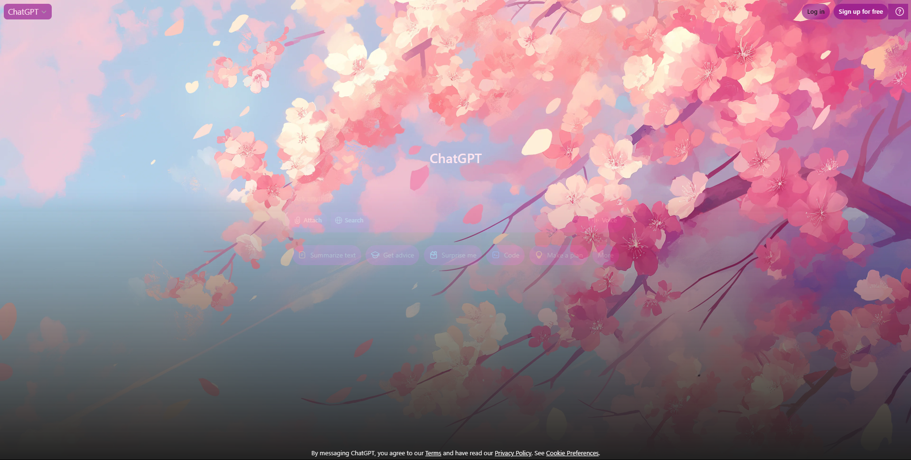
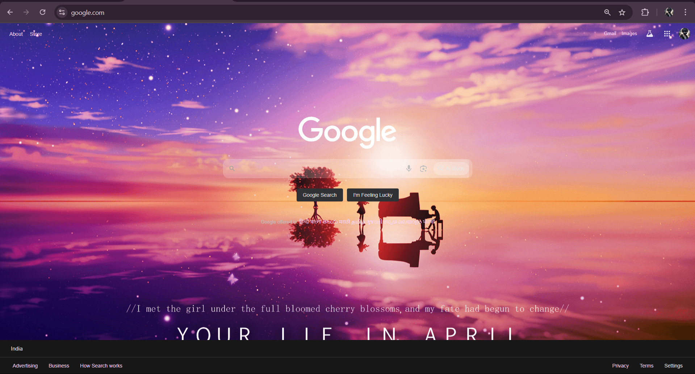
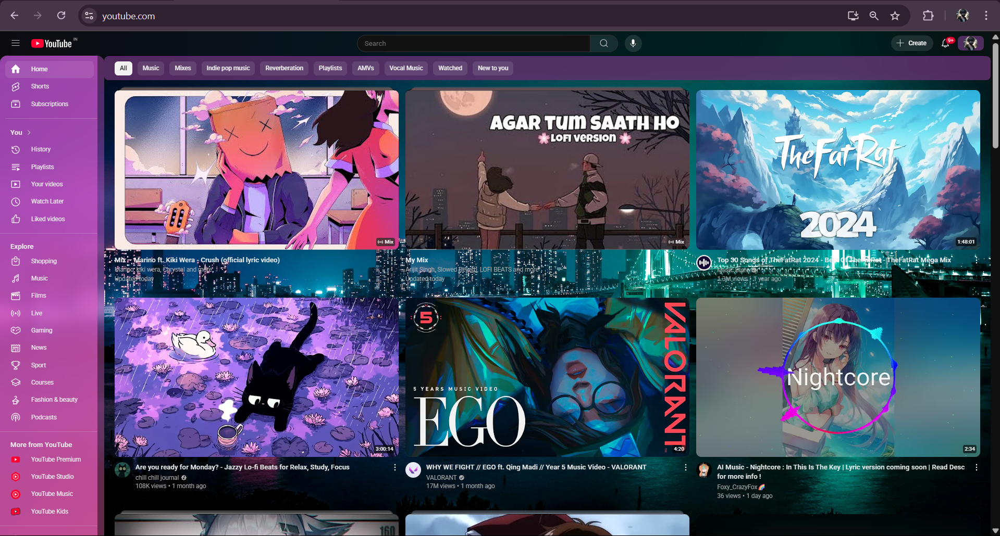

# Sakura & Glass UserStyles Collection ~

Make your web feel magical and soft with fully customized **UserStyles** – crafted in dreamy pink glassmorphism to transform ChatGPT, Gmail, Google Search, and YouTube.

> Designed with [Stylus](https://add0n.com/stylus.html)  
> 🛠 Built with CSS & lots of pink inspiration

---

## 📂 Table of Contents
- [✨ Overview](#-overview)
- [🖼 Previews](#-previews)
- [🎨 Included Themes](#-included-themes)
- [🌱 Installation](#-installation)
- [🔧 Tools & Structure](#-tools--structure)
- [✏️ Author](#-author)
- [📜 License](#-license)

---

## Overview
A collection of aesthetic **UserStyles**:
- 🌸 Soft sakura backgrounds
- 🩰 Glass blur & transparency
- 🪞 Rounded corners & gentle glows
- 🌱 Calming color palette for daily browsing

---

## Previews

| ChatGPT Sakura~ | Gmail Crystal Sakura |
|:--:|:--:|
|  |  |

| Google Redesign~ | YouTube ~ |
|:--:|:--:|
|  |  |

---

## Included Themes

### ChatGPT Sakura~
- Soft sakura wallpaper, glass chat input, rounded buttons, pink glows
- Transparent panels & better contrast
> **Domain:** `chatgpt.com` | **Version:** 1.0.3

---

### Gmail Fully Crystal Sakura by Ivy~
- Sakura background everywhere
- Transparent glass panels & sidebars
- Pink hover glow, rounded cards, white text, pink scrollbars
> **Domain:** `mail.google.com` | **Version:** 1.0

---

### Google Redesign~
- Dark glass cards & search bar with pink glow
- Blurred top menu, hidden black footer, pink highlights
> **Domain:** `*.google.com` | **Version:** 1.0.0

---

### YouTube ~
- Sakura background, transparent containers
- Pink gradient sidebar, glass search box, pink scrollbars
> **Domain:** `youtube.com` | **Version:** 1.0.0

---

## Installation

> Built as UserCSS to use with **Stylus**:

1️⃣ Install [Stylus browser extension](https://add0n.com/stylus.html)  
2️⃣ Copy each style’s code into a new UserStyle  
3️⃣ Save & enable – enjoy your sakura glass world! 🌸

---

## Tools & Structure

**Tools Used:**
- ✏️ CSS
- 🛠 [Stylus](https://add0n.com/stylus.html) (browser extension)
- 🎨 [wallpapercave.com](https://wallpapercave.com) for aesthetic backgrounds

**Repo Structure:**
📦 `root/`  
├─ 📄 `README.md`  
├─ 📄 `LICENSE`  
├─ 📂 `images/`  
│  ├─ `chatgpt-preview.png`  
│  ├─ `gmail-preview.png`  
│  ├─ `google-preview.png`  
│  └─ `youtube-preview.png`  
├─ 📂 `styles/`  
│  ├─ `chatgpt-sakura.user.css`  
│  ├─ `gmail-crystal-sakura.user.css`  
│  ├─ `google-redesign.user.css`  
│  └─ `youtube.user.css`

---

## Author
Made by **Navneet~**  
> _"Umm… nothing..."_

---

## License
MIT License – free to use, fork & share.  
> ⭐ **Star** the repo if you like it & spread the sakura magic! 🌸

---

